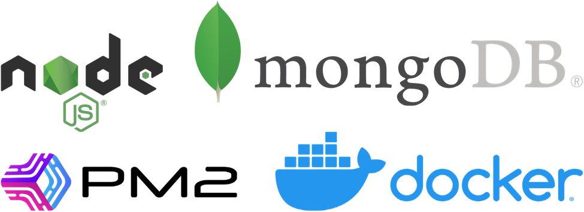

# Nodejs, MongoDB & Mongo Express Docker Container Environment
#### Disposable development environment based on Docker container technology

---

#### Run
###### by script(s) from package.json
Run the following package script from `terminal` or `VSCode NPM SCRIPTS` makes no different

by Terminal command
`yarn run start`

by VSCode
> - go to `NPM SCRIPTS` on bottom left corner
> - click `play` button on the row `start`

---

###### Components
#### Nodejs
- Based on tag [node:14-slim](https://hub.docker.com/_/node?tab=tags&page=1&ordering=last_updated&name=14-slim "14-slim") with [PM2](https://pm2.keymetrics.io/) in deamon & watch mode.
- Change of Process Manager can be found from [.docker/nodejs/Dockerfile](.docker/nodejs/Dockerfile "nodejs-mongo-mongoexpress/.docker/nodejs/Dockerfile") under `RUN` & `CMD` command.
- Dockerfile located at `.docker/nodejs/Dockerfile`.
- Node app file stored in `src/app.js`.
- [mongoose](https://mongoosejs.com/) is the only dependencies of the sample app.
- Script(s) in package.json was designed to reset data & docker image clean up. It is because the PM2 takecare of the launch in Dockerfile already.
- The container will mount the your current folder into /usr/node/app as application work directory, and it will reserve `node_modules` as separated volume for reuse and avoid of 'override'.
- Ports, your local machine port 80 will be use as mapping to Nodejs App, change it in Dockerfile for your needs.
- Common parameters stored in `.env` like database information.

#### MongoDB
- Based on tag [mongodb:4.4](https://hub.docker.com/layers/mongo/library/mongo/4.4/images/sha256-8f2c9016beb50c2972e54c732d8dc24fb332360104b9e71767af9c4e71c1348e?context=explore).
- Initial database user account information can be found in `.env`.
- `mongod.conf` can be found from `.docker/mongodb/mongod.conf`.
- Data & log files stored under `.docker/mongodb/data/`.
- Database user(s) account will be create (if not exist) when building the container and the script can be found from `.docker/mongodb/initdb.d/`.

#### Mongo Express
- [Mongo Express](https://github.com/mongo-express) is an open source Web-based MongoDB admin interface, written with Node.js and express since 2012.
- To disable Mongo Express, please comment out the services group `mongo-express` from `docker-compose.yml`.
- Database user account & login information can be found in `.env`.
